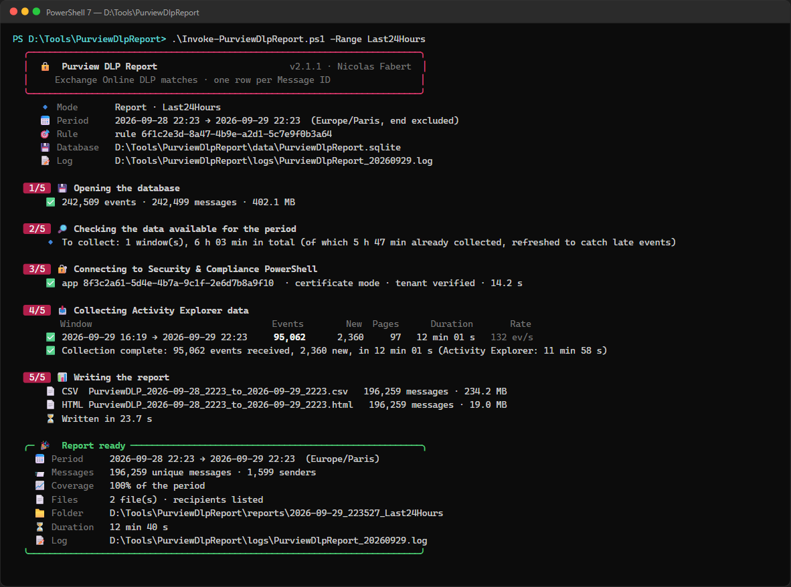

# Purview DLP Report

Reports the Exchange Online messages matched by a **Microsoft Purview DLP rule** — for example the messages sent to **more than 25 recipients** — as CSV and HTML files, **one row per Message ID**.

> [!IMPORTANT]
> Files downloaded from the Internet may be blocked by Windows and fail to run. Before using this project, unblock every file in the downloaded folder:
>
> ```powershell
> Get-ChildItem "C:\Chemin\Du\Dossier" -Recurse -File -Force | Unblock-File
> ```
>
> Replace the example path with the folder where you downloaded or extracted this project.
>
> The `Install-Module` commands in this documentation use `-Force`, so they also update or reinstall a module that is already installed. If an older version still conflicts, close every PowerShell window, open a new one (as administrator for `-Scope AllUsers`), run `Uninstall-Module <ModuleName> -AllVersions -Force`, then run the `Install-Module` command again.


## Why

To reduce the volume of e-mail, organisations often want to limit the messages sent to a large audience. The measure is usually prepared with a DLP policy in **audit mode**, then applied by the policy itself or by a recipient limit per mailbox. In both cases the business lines need to see **which messages are concerned** — who sends, to whom, about what, when — and the administrators need facts to maintain the **exception list**. This tool produces that report.

## How it works

```
Activity Explorer  ──►  local SQLite history  ──►  CSV + HTML report
(filtered on the policy     (beyond the 30 days      (one row per Message ID,
 and the rule at source)     of Activity Explorer)     local files only)
```

- **Source**: Microsoft Purview Activity Explorer (`Export-ActivityExplorerData`), filtered on Exchange, `DLPRuleMatch`, the policy and the rule at the source.
- **History**: a local SQLite database keeps what Activity Explorer forgets after 30 days. Collections are restartable, never store an event twice, and re-read the last hours to catch late events.
- **Report**: one row per unique Message ID — detection time, sender, recipients (optional), subject, recipient count, Message ID — as CSV and a self-contained HTML file with filters, Top 10 senders and message details. Large periods are split by day, week or number of rows.
- **Read-only** for Microsoft 365: the tool never sends e-mail and never changes a setting.



## Requirements

| Item | Requirement |
|---|---|
| PowerShell | 7.4 or later (7.6 for ExchangeOnlineManagement 3.10 or later) |
| Module | ExchangeOnlineManagement 3.9.0 or later — **not 3.10.0 in certificate mode** (bug fixed in 3.10.1) |
| Console | Windows Terminal (emoji and colours) |
| Permissions | A Purview role that can read Activity Explorer. For unattended runs: an application with a certificate, `Exchange.ManageAsApp`, and the Purview role **Information Protection Reader** (guide, Annex F) |
| SQLite | Bundled in `lib\sqlite` — nothing to install |

## Quick start

```powershell
git clone https://github.com/Nico77600/PurviewDlpReport.git
cd PurviewDlpReport\package
notepad .\config\PurviewDlpReport.config.psd1      # TenantId, PolicyId, RuleId, authentication

.\Invoke-PurviewDlpReport.ps1 -Mode Status          # checks the configuration, no connection
.\Invoke-PurviewDlpReport.ps1                       # report of the last 7 days
.\Invoke-PurviewDlpReport.ps1 -Range PreviousMonth  # previous calendar month
.\Invoke-PurviewDlpReport.ps1 -Mode Collect         # daily collection (scheduled task)
```

Activity Explorer keeps 30 days of data: schedule the daily collection. The `package` folder of this repository holds exactly the files needed to run Purview DLP Report, with the guide. The zip of each [release](https://github.com/Nico77600/PurviewDlpReport/releases) contains the same run-time files with the HTML guide; `.\tools\New-DlpPackage.ps1` builds that zip content from the repository.

## Documentation

The **administrator guide** covers installation, configuration, unattended execution with a certificate, least-privilege access, the report, troubleshooting and the internals:

- [package/docs/PurviewDlpReport-Guide.md](package/docs/PurviewDlpReport-Guide.md)
- `package/docs/PurviewDlpReport-Guide.html` — the same guide as a single HTML file (download it and open it locally)

## Per business line: Microsoft Fabric companion

To give every business line, manager and employee **their own view** of the report instead of sending everyone every row, the optional companion [**Purview DLP Report for Microsoft Fabric**](https://github.com/Nico77600/PurviewDlpReport-Fabric) publishes the same rows to Microsoft Fabric: a Power BI report with row-level security and an agent in Microsoft Teams. This tool is not changed and does not depend on it.

## Tests

```powershell
Invoke-Pester -Path .\tests      # Pester 5, no connection to Microsoft 365
```

## License

[MIT](LICENSE). The bundled SQLite components keep their own licenses: see [THIRD-PARTY-NOTICES.md](package/THIRD-PARTY-NOTICES.md).

## Disclaimer

Personal project, provided as is. It is not an official Microsoft product and is not supported by Microsoft. Test it in your environment before production use.