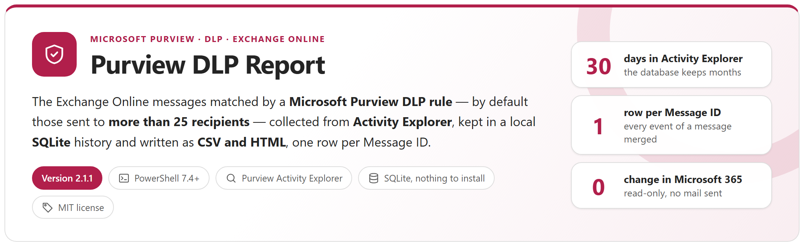
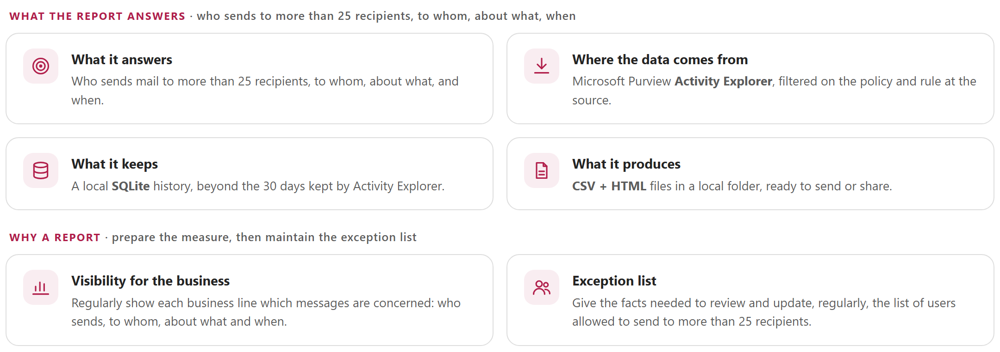
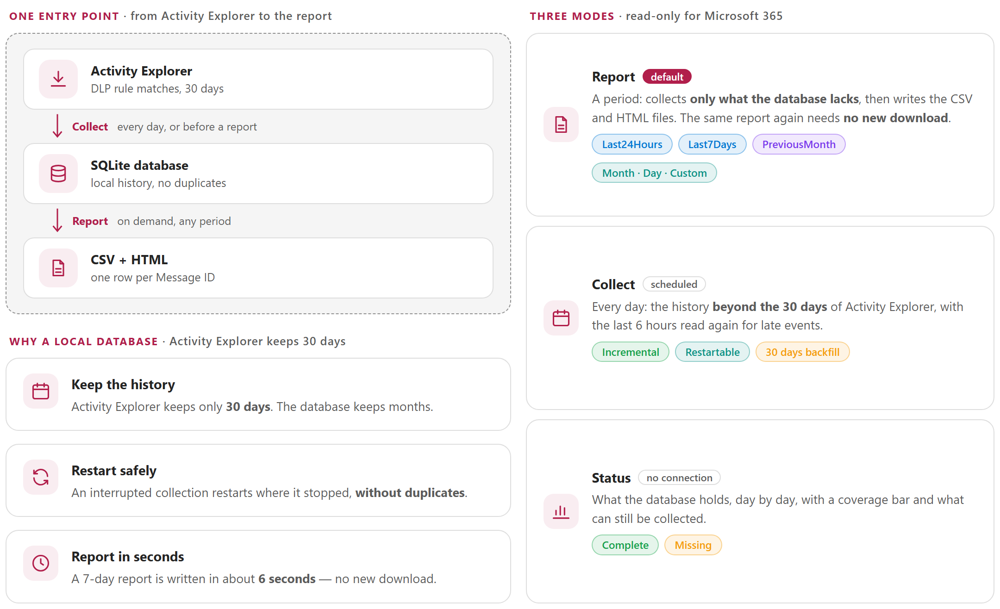
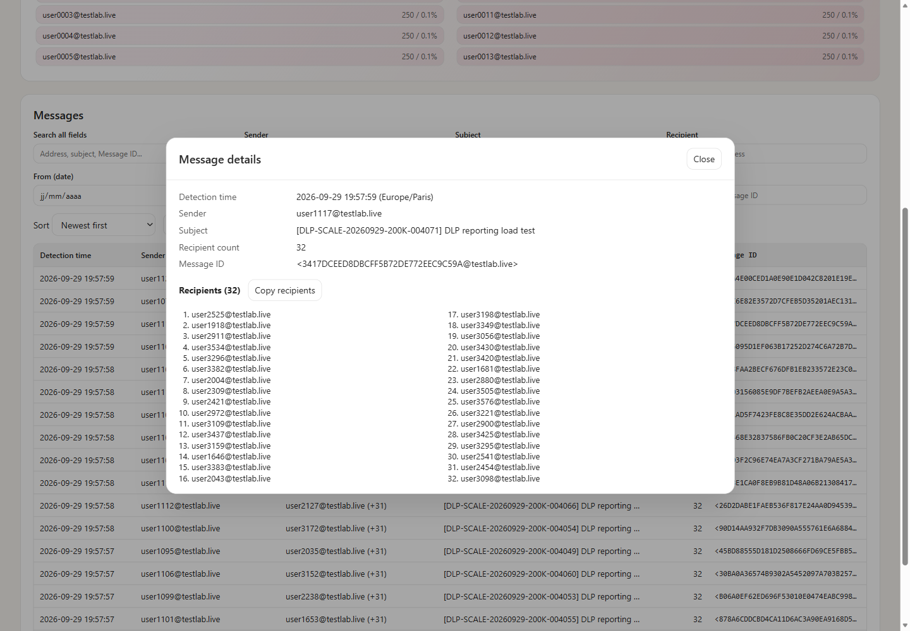

<p align="center">
  <picture>
    <source media="(prefers-color-scheme: dark)" srcset="package/docs/images/readme-banner-dark.png">
    
  </picture>
</p>

<p align="center">
  <a href="#why"><b>Why</b></a> &nbsp;&middot;&nbsp;
  <a href="#how-it-works"><b>How it works</b></a> &nbsp;&middot;&nbsp;
  <a href="#per-business-line-microsoft-fabric-companion"><b>Microsoft Fabric companion</b></a> &nbsp;&middot;&nbsp;
  <a href="#reports"><b>Reports</b></a> &nbsp;&middot;&nbsp;
  <a href="#quick-start"><b>Quick start</b></a> &nbsp;&middot;&nbsp;
  <a href="package/docs/PurviewDlpReport-UserGuide.md"><b>User guide</b></a> &nbsp;&middot;&nbsp;
  <a href="package/docs/PurviewDlpReport-Guide.md"><b>Developer guide</b></a>
</p>

> [!IMPORTANT]
> Files downloaded from the Internet may be blocked by Windows and fail to run. Before using this project, unblock every file in the downloaded folder:
>
> ```powershell
> Get-ChildItem "C:\Chemin\Du\Dossier" -Recurse -File -Force | Unblock-File
> ```
>
> Replace the example path with the folder where you downloaded or extracted this project.
>
> The `Install-Module` commands in this documentation use `-Force`, so they also update or reinstall a module that is already installed. If an older version still conflicts, close every PowerShell window, open a new one (as administrator for `-Scope AllUsers`), run `Uninstall-Module <ModuleName> -AllVersions -Force`, then run the `Install-Module` command again.

## Why

To reduce the volume of e-mail, organisations often want to limit the messages sent to a large audience. The measure is usually prepared with a DLP policy in **audit mode**, then applied by the policy itself or by a recipient limit per mailbox. In both cases the business lines need to see **which messages are concerned** — who sends, to whom, about what, when — and the administrators need facts to maintain the **exception list**. This tool produces that report.

<picture>
  <source media="(prefers-color-scheme: dark)" srcset="package/docs/images/readme-principles-dark.png">
  
</picture>

## How it works

<picture>
  <source media="(prefers-color-scheme: dark)" srcset="package/docs/images/readme-how-it-works-dark.png">
  
</picture>

- **Source**: Microsoft Purview Activity Explorer (`Export-ActivityExplorerData`), filtered on Exchange, `DLPRuleMatch`, the policy and the rule at the source.
- **History**: a local SQLite database keeps what Activity Explorer forgets after 30 days. Collections are restartable, never store an event twice, and re-read the last hours to catch late events.
- **Report**: one row per unique Message ID — detection time, sender, recipients (optional), subject, recipient count, Message ID — as CSV and a self-contained HTML file with filters, Top 10 senders and message details. Large periods are split by day, week or number of rows.
- **Read-only** for Microsoft 365: the tool never sends e-mail and never changes a setting.

## Reports

<table>
  <tr>
    <td width="50%" valign="top"><a href="package/docs/images/report-overview.png"></a><br><sub><b>HTML report</b> &middot; matching messages, senders, average and largest audience, distribution by recipient count, Top 10 senders and the table of every message</sub></td>
    <td width="50%" valign="top"><a href="package/docs/images/report-details.png"></a><br><sub><b>A message</b> &middot; detection time, sender, subject, recipient count, Message ID and the full recipient list, with <b>Copy recipients</b></sub></td>
  </tr>
  <tr>
    <td width="50%" valign="top"><a href="package/docs/images/console-report.png"></a><br><sub><b>Console</b> &middot; five steps: database, plan, connection, collection window by window, then the CSV and HTML files written</sub></td>
    <td width="50%" valign="top"><a href="package/docs/images/console-status.png"></a><br><sub><b>Status</b> &middot; what the database holds, day by day, with a coverage bar — and no connection to Microsoft 365</sub></td>
  </tr>
</table>

## Requirements

| Item | Requirement |
|---|---|
| PowerShell | 7.4 or later (7.6 for ExchangeOnlineManagement 3.10 or later) |
| Module | ExchangeOnlineManagement 3.9.0 or later — **not 3.10.0 in certificate mode** (bug fixed in 3.10.1) |
| Console | Windows Terminal (emoji and colours) |
| Permissions | A Purview role that can read Activity Explorer. For unattended runs: an application with a certificate, `Exchange.ManageAsApp`, and the Purview role **Information Protection Reader** (guide, Annex F) |
| SQLite | Bundled in `lib\sqlite` — nothing to install |

## Quick start

```powershell
git clone https://github.com/Nico77600/PurviewDlpReport.git
cd PurviewDlpReport\package
notepad .\config\PurviewDlpReport.config.psd1      # TenantId, PolicyId, RuleId, authentication

.\Invoke-PurviewDlpReport.ps1 -Mode Status          # checks the configuration, no connection
.\Invoke-PurviewDlpReport.ps1                       # report of the last 7 days
.\Invoke-PurviewDlpReport.ps1 -Range PreviousMonth  # previous calendar month
.\Invoke-PurviewDlpReport.ps1 -Mode Collect         # daily collection (scheduled task)
```

Activity Explorer keeps 30 days of data: schedule the daily collection. The `package` folder of this repository holds exactly the files needed to run Purview DLP Report, with both guides. The zip of each [release](https://github.com/Nico77600/PurviewDlpReport/releases) contains the same run-time files with the HTML guides; `.\tools\New-DlpPackage.ps1` builds that zip content from the repository.

## Documentation

| Guide | Content |
|---|---|
| **[User guide](package/docs/PurviewDlpReport-UserGuide.md)** | **What you need and what you run**: prerequisites and permissions, the one-time setup (configuration, policy and rule identifiers), the command for each period, the daily collection as a scheduled task, how to read the CSV and HTML files, status, logs, exit codes, and the situations met most often. |
| **[Developer guide](package/docs/PurviewDlpReport-Guide.md)** | Everything else: the project background, how it works, every configuration key, the application with a certificate and least-privilege access, output files and splitting, the code map, how to modify and test the tool, troubleshooting, why Activity Explorer, the lab measurements and the database schema. |

Both guides also exist as a single HTML file with a light and a dark theme (`package/docs/PurviewDlpReport-UserGuide.html`, `package/docs/PurviewDlpReport-Guide.html`): download them and open them locally, or use the copies in the release zip.

## Per business line: Microsoft Fabric companion

To give every business line, manager and employee **their own view** of the report instead of sending everyone every row, the optional companion [**Purview DLP Report for Microsoft Fabric**](https://github.com/Nico77600/PurviewDlpReport-Fabric) publishes the same rows to Microsoft Fabric: a Power BI report with row-level security and an agent in Microsoft Teams. This tool is not changed and does not depend on it.

## Tests

```powershell
Invoke-Pester -Path .\tests      # Pester 5, no connection to Microsoft 365
```

`tools\Build-Documentation.ps1` rebuilds the HTML guides; `tools\New-ReadmeImages.ps1` renders the graphics of this page from the guide, in a light and a dark version.

## License

[MIT](LICENSE). The bundled SQLite components keep their own licenses: see [THIRD-PARTY-NOTICES.md](package/THIRD-PARTY-NOTICES.md).

## Disclaimer

Personal project, provided as is. It is not an official Microsoft product and is not supported by Microsoft. Test it in your environment before production use.
