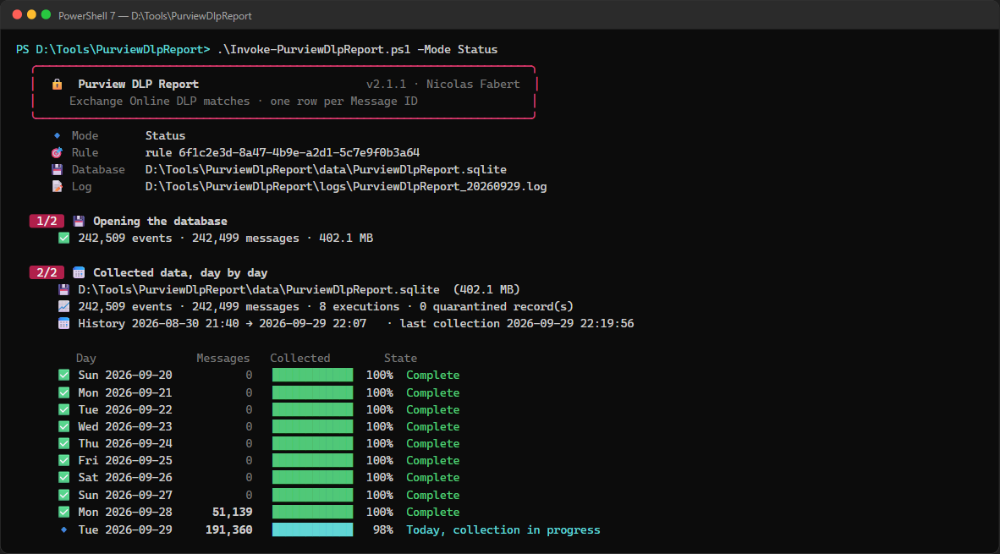
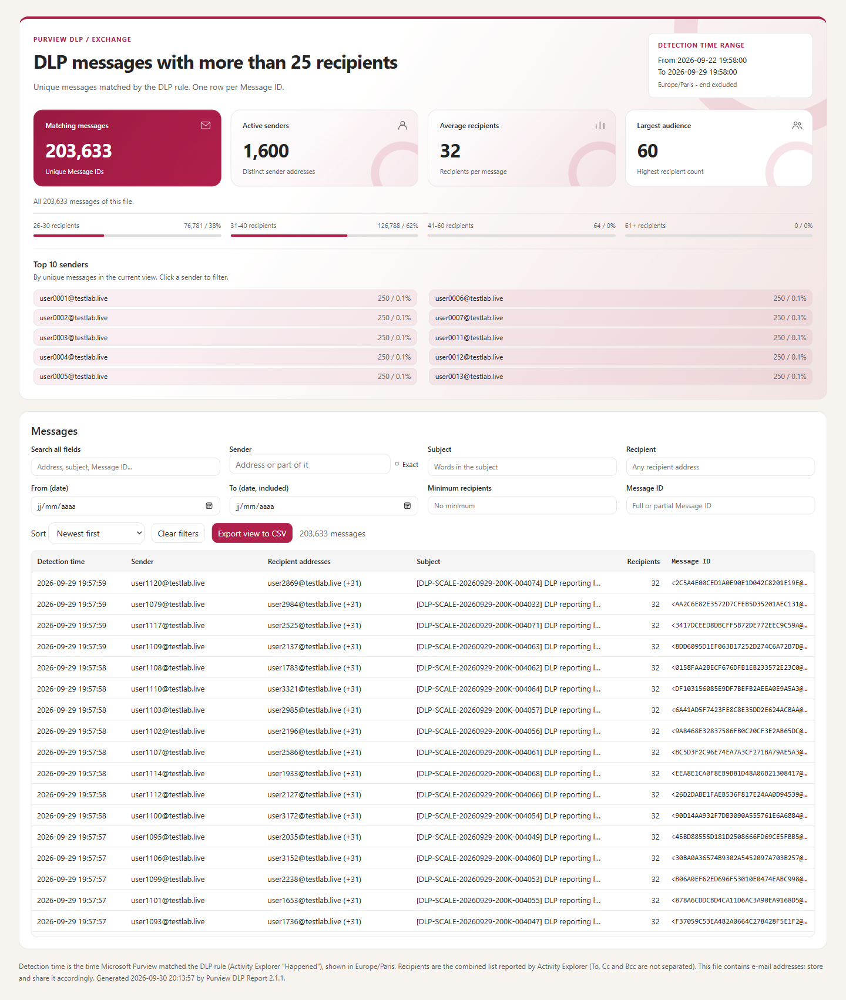

# Purview DLP Report — Administrator guide

> Reports the Exchange Online messages matched by a Microsoft Purview DLP rule — by default, **messages sent to more than 25 recipients** — as CSV and HTML files, **one row per Message ID**.

> [!IMPORTANT]
> Files downloaded from the Internet may be blocked by Windows and fail to run. Before using this project, unblock every file in the downloaded folder:
>
> ```powershell
> Get-ChildItem "C:\Chemin\Du\Dossier" -Recurse -File -Force | Unblock-File
> ```
>
> Replace the example path with the folder where you downloaded or extracted this project.
>
> The `Install-Module` commands in this documentation use `-Force`, so they also update or reinstall a module that is already installed. If an older version still conflicts, close every PowerShell window, open a new one (as administrator for `-Scope AllUsers`), run `Uninstall-Module <ModuleName> -AllVersions -Force`, then run the `Install-Module` command again.

```cards
target | What it answers | Who sends mail to more than 25 recipients, to whom, about what, and when.
download | Where the data comes from | Microsoft Purview **Activity Explorer**, filtered on the policy and rule at the source.
database | What it keeps | A local **SQLite** history, beyond the 30 days kept by Activity Explorer.
file | What it produces | **CSV + HTML** files in a local folder, ready to send or share.
```

## Quick start

```steps
Check the prerequisites | PowerShell 7.4+, module `ExchangeOnlineManagement` **3.9 or later**, an account allowed to read Activity Explorer.
Edit the configuration | Open `config\PurviewDlpReport.config.psd1`: tenant, DLP policy and rule, authentication.
Run a first report | `.\Invoke-PurviewDlpReport.ps1` — the last 7 days, collected then written to `reports\`.
Schedule the daily collection | `.\Invoke-PurviewDlpReport.ps1 -Mode Collect` every day, so that nothing is lost after 30 days.
```

> [!IMPORTANT]
> The tool is **read-only** for Microsoft 365: it never sends e-mail and never changes a setting. Reports stay on the local disk; the administrator sends or shares them.

# Part I · Understand

<!-- icon: book -->
## 1. Project background

**Why this tool**

- Many organisations want to **reduce the volume of e-mail**. A common measure is to limit the messages sent to **more than 25 recipients**, except for the users on an **exception list**.
- The measure is usually prepared with a Microsoft Purview **DLP policy in audit mode**: it detects these messages but does not block them.
- The blocking can then rely on the same DLP policy, or on a recipient limit per mailbox in Exchange Online (`Set-Mailbox -RecipientLimits`).

**Why a report**

To prepare the measure and then apply it, the organisation must see **which messages are concerned** and decide **which exceptions** are justified.

```cards
chart | Visibility for the business | Regularly show each business line which messages are concerned: who sends, to whom, about what and when.
people | Exception list | Give the facts needed to review and update, regularly, the list of users allowed to send to more than 25 recipients.
```

**Design assumptions**

| Assumption | Value |
|---|---|
| Volume | Tens of thousands of messages per day — tested in the lab with more than 200,000 events in one day |
| Periods | last 24 hours, last 7 days, a month, a day or any range |
| Delivery | local files; the administrator sends them or places them on a share |
| Alerting | Not needed: the tool reads Activity Explorer, DLP alerts can stay disabled |

<!-- icon: flow -->
## 2. How it works

The tool works in **two stages**. The database sits in the middle.

```flow
download | Activity Explorer | DLP rule matches, 30 days
arrow | Collect | every day, or before a report
database | SQLite database | local history, no duplicates
arrow | Report | on demand, any period
file | CSV + HTML | one row per Message ID
```

| Stage | What happens | When |
|---|---|---|
| **1 · Collect** | Reads the rule matches from Activity Explorer (`Export-ActivityExplorerData`) and stores them in the database. | Every day (scheduled task), and automatically before a report if something is missing. |
| **2 · Report** | Reads the database and writes one CSV and one HTML file for the requested period. | On demand. |

**Why a local database?**

```cards
calendar | Keep the history | Activity Explorer keeps only **30 days**. The database keeps months.
refresh | Restart safely | An interrupted collection restarts where it stopped, **without duplicates**.
clock | Report in seconds | A 7-day report is written in about **6 seconds** — no new download.
```

**Columns of the report** — the business need, nothing more:

| Column | Content |
|---|---|
| Detection time | When Purview matched the rule, in the report time zone, to the second |
| Sender | Sender address |
| Recipients | All recipient addresses — **optional** (`IncludeRecipientDetails`) |
| Subject | Message subject |
| Recipient count | Number of recipients reported by the DLP rule |
| Message ID | Internet Message ID, the unique key of a message |

<!-- icon: lightbulb -->
## 3. Three things to know

> [!WARNING]
> **Activity Explorer keeps 30 days.** A day that was not collected within 30 days is lost for this tool. Schedule the daily collection (chapter 7).

> [!NOTE]
> **Activity Explorer is not real time.** Microsoft states 60 to 90 minutes for Exchange events; the lab saw 803 events arrive late in one evening. The tool therefore collects the **last 6 hours again** at every run (`SettlingHours`). The most recent hours of a report are provisional.

> [!TIP]
> **One row = one message matched by the DLP rule.** With the policy in audit mode, these messages were **delivered**: the report shows what the measure would block. If the rule blocks them later, the same report lists the blocked messages. The report depends on this rule: whatever blocking method is chosen, keep the rule and check that it still records the messages.

# Part II · Set up

<!-- icon: checklist -->
## 4. Prerequisites

### Server or workstation

| Item | Requirement | Validated in the lab |
|---|---|---|
| Operating system | Windows 10/11 or Windows Server 2016+, x64 or ARM64 | Windows 11 x64 |
| PowerShell | **PowerShell 7.4 or later** — not Windows PowerShell 5.1 | 7.6.6 |
| Console | **Windows Terminal** — the display shown in this guide | Windows Terminal |
| Module | **ExchangeOnlineManagement 3.9.0 or later — not 3.10.0 in certificate mode** (bug fixed in 3.10.1; the tool skips it). Versions 3.10 and later need PowerShell 7.6. | 3.9.2 · 3.10.1 |
| SQLite | Supplied in `lib\sqlite` — nothing to install | SQLite 3.53.3 |
| Disk | About **1.5 to 2.5 GB per month** of database at 30–50k messages/day — **9 to 15 GB** with the default retention of 180 days — plus the reports | 461 MB for 278k events |
| Browser | Recent Edge, Chrome or Firefox, to open the HTML report | Edge |
| Network | HTTPS to `*.protection.outlook.com`, `*.compliance.protection.outlook.com`, `login.microsoftonline.com` | — |

```powershell
# Install or update the Exchange Online module: 3.10.1 or later with PowerShell 7.6,
# 3.9.2 with PowerShell 7.4 or 7.5
Install-Module ExchangeOnlineManagement -MinimumVersion 3.10.1 -Scope CurrentUser -Force
Install-Module ExchangeOnlineManagement -RequiredVersion 3.9.2 -Scope CurrentUser -Force
```

### Permissions

```cards
people | Administrator account (interactive) | One of the role groups that can read Activity Explorer: **Compliance Administrator**, **Security Administrator**, **Security Reader**, or the Purview *Information Protection* role groups.
key | Application (unattended) | A dedicated app registration with a certificate, the **Exchange.ManageAsApp** permission, and the Purview role **Information Protection Reader** through a dedicated role group — chapter 7 and Annex F.
```

> [!NOTE]
> Reference: [Get started with activity explorer — permissions](https://learn.microsoft.com/purview/data-classification-activity-explorer#permissions). If the account has no suitable role, the tool stops with a clear message (Annex A).

<!-- icon: download -->
## 5. Installation

```steps
Copy the package | Copy the package folder (`PurviewDlpReport-<version>`, made by `tools\New-DlpPackage.ps1`) to the server, for example `D:\Tools\PurviewDlpReport`.
Unblock the files | `Get-ChildItem D:\Tools\PurviewDlpReport -Recurse -File -Force | Unblock-File` (files copied from the Internet or a share).
Edit the configuration | `config\PurviewDlpReport.config.psd1` — the *Tenant*, *Target* and *Authentication* values are empty in the package: fill them in (chapter 6).
Check without connecting | `.\Invoke-PurviewDlpReport.ps1 -Mode Status` — checks the configuration and builds the engine (about 2 s, once). On a new installation it ends with *Ready for the first collection*; later it shows the content of the database.
```

**What is in the folder**

| Path | Content |
|---|---|
| `Invoke-PurviewDlpReport.ps1` | **The only script to run** |
| `config\PurviewDlpReport.config.psd1` | All the settings |
| `PurviewDlpReport.psd1` / `.psm1` | PowerShell module used by the script |
| `src\PurviewDlpReport.Engine.cs` | C# engine: reading, database, CSV/HTML writing |
| `templates\Report.template.html` | Look and behaviour of the HTML report |
| `lib\sqlite\` | SQLite libraries (see `THIRD-PARTY-NOTICES.md`) |
| `docs\PurviewDlpReport-Guide.html` | This guide |
| `data\` · `reports\` · `logs\` · `bin\` | Created at run time — the package contains **no database**, the first run creates an empty one. **Back up `data\`**: it is the only history beyond 30 days. |

> [!NOTE]
> The package holds only what is needed to run. The git repository of the tool also contains the Markdown source of this guide, `tests\` (automated tests) and `tools\` (documentation builder, package builder) — see chapters 11 to 13.

<!-- icon: settings -->
## 6. Configuration

Everything is set in **`config\PurviewDlpReport.config.psd1`**. It is a PowerShell data file: text between quotes, `$true` / `$false`, numbers, `@( )` for lists, `#` for comments.

> [!TIP]
> When a value is wrong, the tool lists **all** the problems at once and stops before doing anything. Relative paths (`.\data`) are relative to the tool folder.

### Tenant and target rule

| Key | Meaning |
|---|---|
| `Tenant.TenantId` | Tenant GUID — a **safety check**, in both modes: after sign-in, the tool compares the tenant it is connected to with this value and stops if they differ (for example an account that also exists in another tenant). The data never mixes tenants. |
| `Tenant.Organization` | Initial domain `xxx.onmicrosoft.com` — **certificate mode only**. `Connect-IPPSSession -Organization` requires the tenant *name* and rejects the GUID (*"Organization cannot be a Guid"*, tested). Not used in interactive mode. |
| `Target.PolicyId` | DLP policy identifier, as shown in an Activity Explorer event. |
| `Target.RuleId` | DLP rule identifier as shown in Activity Explorer = the rule **ImmutableId**. |
| `Target.PolicyName`, `Target.RuleName` | Optional, display only. Without them, the console shows the rule ID and the report no name. |

```powershell
# Find the identifiers (Security & Compliance PowerShell)
Connect-IPPSSession
Get-DlpCompliancePolicy -Identity '<policy name>' | Select-Object Name, ImmutableId, Guid
Get-DlpComplianceRule   -Identity '<rule name>'   | Select-Object Name, ImmutableId, Guid
```

> [!CAUTION]
> The rule **Guid** is *not* the value used by Activity Explorer — use **ImmutableId**. When in doubt, open one event of the rule in Activity Explorer and copy `PolicyId` / `RuleId`.

### Authentication

| Key | Values | Meaning |
|---|---|---|
| `Mode` | `Interactive` · `Certificate` | Administrator sign-in, or application with a certificate (scheduled task). |
| `UserPrincipalName` | account | Interactive: expected account (`''` accepts any account of the tenant). |
| `DisableWAM` | `$true` | Interactive: sign in through the **browser** instead of the Windows broker (WAM). **Keep `$true`**: without it, PowerShell 7 crashed after 11 s during the lab test (`0xC0000005` in `msalruntime.dll`, the WAM library of ExchangeOnlineManagement 3.9.2). |
| `AppId` · `CertificateThumbprint` | GUID · 40 hex characters | Certificate mode. |

### Collection

| Key | Default | Meaning |
|---|---|---|
| `PageSize` | `1000` | Records per call (1–5000). 1000 validated on 200k events. |
| `SliceHours` | `24` | Longest request window. Windows never cross local midnight. |
| `SettlingHours` | `6` | The last hours are collected again at the next run (late events). |
| `BackfillDays` | `30` | How far back `-Mode Collect` and the first collection go. |
| `SourceRetentionDays` | `30` | Activity Explorer retention. Older missing periods are reported as lost. |
| `RetentionWarningDays` | `7` | Warn when a missing period will be lost within this many days. |
| `MaxSliceRestarts` | `2` | Retries of a window after an error, before splitting it in two. |
| `MinimumSliceMinutes` · `MaxPagesPerSlice` · `CookieSafetySeconds` | `15` · `2000` · `105` | Safety limits — no need to change them. |

### Storage

| Key | Default | Meaning |
|---|---|---|
| `DatabasePath` | `.\data\PurviewDlpReport.sqlite` | Database file. **Back it up.** |
| `RetentionDays` | `180` | Events older than this are deleted at each collection, and the file shrinks (`0` = keep everything). 180 days ≈ 9 to 15 GB. |
| `KeepQuarantinedRecords` | `$true` | Keep the raw JSON of unreadable records (troubleshooting). |

### Report

| Key | Default | Meaning |
|---|---|---|
| `DefaultRange` | `Last7Days` | Period used when `-Range` is not given. |
| `TimeZone` | `Europe/Paris` | Time zone of dates, days, weeks and months. |
| `OutputPath` · `FilePrefix` | `.\reports` · `PurviewDLP` | Where and how files are named. |
| `Formats` | `@('Csv','Html')` | Files to write. |
| `IncludeRecipientDetails` | `$true` | `$true`: recipient addresses in CSV and HTML. `$false`: count only — CSV about 6× smaller. |
| `SplitBy` · `MaxRowsPerFile` | `Week` · `500000` | Splitting, used only above `MaxRowsPerFile` (chapter 10). |
| `CsvDelimiter` · `Title` | `;` · … | `;` opens directly in Excel with French regional settings. |

### Logging and console

| Setting | Meaning |
|---|---|
| `Logging.Path` · `Logging.RetentionDays` | One log file per day in `.\logs`, kept **30 days** (deleted at each run). |
| Environment variable `NO_COLOR` | Disables colours. `PDR_FORCE_COLOR=1` keeps them when the output is redirected. |

### Command-line overrides

The command line chooses **what to do**. A few report settings can be changed for one execution:

| Parameter | Overrides |
|---|---|
| `-IncludeRecipientDetails` · `-IncludeRecipientDetails:$false` | `Report.IncludeRecipientDetails` |
| `-SplitBy Rows\|Day\|Week` · `-MaxRowsPerFile 200000` | Splitting |
| `-OutputPath D:\Out` | `Report.OutputPath` |
| `-ConfigPath D:\Other.psd1` | Another configuration file |

<!-- icon: clock -->
## 7. Unattended execution

The daily collection is **mandatory** in production, because Activity Explorer keeps 30 days. Nobody is there to sign in, so it uses an **application with a certificate**.

> [!TIP]
> **Validated in the lab**: `-Mode Collect` in certificate mode, 79,392 events collected in 10 min 20 s, exit code 0 (2026-09-29). With the Purview role **Information Protection Reader** only, the application has 13 commands and no write command (2026-09-30, Annex F).

### Create the application (once)

```steps
Register the application | Microsoft Entra admin center › **App registrations** › **New registration** — name `Purview DLP Report - collector`, single tenant. Note the **Application (client) ID**. Never reuse an application created for another purpose.
Add the permission | **API permissions** › **Add a permission** › **APIs my organization uses** › **Office 365 Exchange Online** › **Application permissions** › `Exchange.ManageAsApp`. Add the same permission on **Microsoft Exchange Online Protection**, then **Grant admin consent**.
Create the certificate | On the server, with the account that runs the task — see the command below. Upload the `.cer` file in **Certificates & secrets**.
Give read access to Activity Explorer | Purview role **Information Protection Reader** in a dedicated role group, through a service principal — **Annex F**, step by step. `Exchange.ManageAsApp` alone is not enough: the export command is then missing.
Fill in the configuration | `Authentication.Mode = 'Certificate'`, `AppId`, `CertificateThumbprint`, `Tenant.Organization`.
Test by hand | `.\Invoke-PurviewDlpReport.ps1 -Mode Collect`. If it returns `UnAuthorized`, check the token (below).
```

```powershell
# Certificate: private key not exportable, 2 years
$cert = New-SelfSignedCertificate -Subject 'CN=PurviewDlpReport-Collector' -CertStoreLocation Cert:\CurrentUser\My `
    -KeyExportPolicy NonExportable -KeySpec Signature -KeyLength 2048 -NotAfter (Get-Date).AddYears(2)
Export-Certificate -Cert $cert -FilePath .\PurviewDlpReport-Collector.cer
$cert.Thumbprint
```

Reference: [App-only authentication for unattended scripts](https://learn.microsoft.com/powershell/exchange/app-only-auth-powershell-v2).

> [!IMPORTANT]
> **Lesson from the lab — grant `Exchange.ManageAsApp` on Office 365 Exchange Online too.** The documentation points to *Microsoft Exchange Online Protection* for Security & Compliance PowerShell. In the lab tenant, the audience used by `Connect-IPPSSession` (`https://ps.compliance.protection.outlook.com`) belongs to **Office 365 Exchange Online**: with the permission on *Exchange Online Protection* only, the token had no role and every connection returned `UnAuthorized` for 25 minutes. With the permission on *Office 365 Exchange Online*, the role appeared **immediately**. Granting it on both is harmless.

**Check the token yourself** — the `roles` claim must contain `Exchange.ManageAsApp`. The Purview role group does not appear in the token (`wids` only lists Microsoft Entra roles):

```powershell
# Uses the MSAL library shipped with the Microsoft.Graph.Authentication module
$core = Get-Module -ListAvailable Microsoft.Graph.Authentication | Sort-Object Version -Descending |
    Select-Object -First 1 | ForEach-Object { Join-Path $_.ModuleBase 'Dependencies' }
Add-Type -Path "$core\Microsoft.IdentityModel.Abstractions.dll", "$core\Core\Microsoft.Identity.Client.dll"
$cert = Get-Item Cert:\CurrentUser\My\<thumbprint>
$app  = [Microsoft.Identity.Client.ConfidentialClientApplicationBuilder]::Create('<AppId>').
    WithCertificate($cert).WithTenantId('<TenantId>').Build()
$jwt  = $app.AcquireTokenForClient([string[]]'https://ps.compliance.protection.outlook.com/.default').
    ExecuteAsync().GetAwaiter().GetResult().AccessToken.Split('.')[1].Replace('-', '+').Replace('_', '/')
while ($jwt.Length % 4) { $jwt += '=' }
[Text.Encoding]::UTF8.GetString([Convert]::FromBase64String($jwt)) | ConvertFrom-Json | Select-Object roles, wids
```

### Create the scheduled task

```powershell
$action = New-ScheduledTaskAction -Execute 'pwsh.exe' `
    -Argument '-NoProfile -NonInteractive -File "D:\Tools\PurviewDlpReport\Invoke-PurviewDlpReport.ps1" -Mode Collect' `
    -WorkingDirectory 'D:\Tools\PurviewDlpReport'
$trigger  = New-ScheduledTaskTrigger -Daily -At 06:00
$settings = New-ScheduledTaskSettingsSet -ExecutionTimeLimit (New-TimeSpan -Hours 6) -StartWhenAvailable -MultipleInstances IgnoreNew
Register-ScheduledTask -TaskName 'Purview DLP Report - daily collection' -Action $action -Trigger $trigger `
    -Settings $settings -User 'DOMAIN\svc-dlpreport' -Password '<password>' -RunLevel Limited
```

```cards
key | Certificate store | The certificate must be in **CurrentUser\My** of the account that runs the task (or LocalMachine\My with read access to the private key).
clock | First run | Collects `BackfillDays` (30) days: about **1 hour per 350,000 events** — several hours in production. Next runs: minutes.
shield | Safety | Two collections never run at the same time (lock file). Running at 06:00 **and** 18:00 limits the risk of losing a day.
```

# Part III · Use

<!-- icon: terminal -->
## 8. Everyday use

Open **PowerShell 7** (`pwsh`) in **Windows Terminal**, go to the tool folder, run one command.

| I want… | Command |
|---|---|
| The last 7 days (default) | `.\Invoke-PurviewDlpReport.ps1` |
| The last 24 hours | `.\Invoke-PurviewDlpReport.ps1 -Range Last24Hours` |
| The previous calendar month | `.\Invoke-PurviewDlpReport.ps1 -Range PreviousMonth` |
| A given month | `.\Invoke-PurviewDlpReport.ps1 -Range Month -Month 2026-08` |
| One day | `.\Invoke-PurviewDlpReport.ps1 -Range Day -Date 2026-09-28` |
| A custom range | `.\Invoke-PurviewDlpReport.ps1 -Range Custom -Start '2026-09-28 08:00' -End '2026-09-29'` |
| Counts only, smaller files | `.\Invoke-PurviewDlpReport.ps1 -Range PreviousMonth -IncludeRecipientDetails:$false` |
| A report without connecting | `.\Invoke-PurviewDlpReport.ps1 -NoCollect` |
| The daily collection | `.\Invoke-PurviewDlpReport.ps1 -Mode Collect` |
| What the database contains | `.\Invoke-PurviewDlpReport.ps1 -Mode Status` |
| The full help | `Get-Help .\Invoke-PurviewDlpReport.ps1 -Full` |

### What you see


```cards
info | Banner | Mode, period, rule, database and log file.
checklist | Numbered steps | 1 database · 2 plan · 3 connection · 4 collection · 5 report.
download | Collection table | One row per window: events, new events, pages, duration, rate — with a progress bar and the remaining time.
target | Summary card | Green when complete, amber when part of the period is missing, red on error.
```

Icons: ✅ done · 🔹 information · ⚠️ attention · ❌ error · ⏩ step skipped. Everything is also written to `logs\PurviewDlpReport_yyyyMMdd.log` — without colours or icons.

### What the database contains



Each day shows its messages, a **coverage bar** and a state: *Complete*, *Complete, refreshed at next run*, *Missing, collectable N more days*, or *no longer collectable*.

### Exit codes

| Code | Meaning |
|---|---|
| `0` | Success |
| `1` | Failure — message on screen and in the log. What was already collected is kept. |
| `2` | Report written but **incomplete**: the summary lists the missing ranges, the HTML shows the coverage. |

> [!TIP]
> **Interrupted?** Close the window or press <kbd>Ctrl</kbd>+<kbd>C</kbd> at any time: every page received is already in the database. Run the **same command again** — only the missing windows are collected, without duplicates.

<!-- icon: chart -->
## 9. Reading the results

### The HTML report



```cards
chart | Header | Period, messages, senders, average and largest audience, distribution by recipient count.
people | Top 10 senders | Two columns. Click a sender to filter the table.
search | Filters | Search everywhere, sender (exact or partial), subject, recipient, dates, minimum recipients, Message ID.
file | Export | **Export view to CSV** saves only the filtered rows.
```

Click a row to see every recipient, with a **Copy recipients** button:


> [!NOTE]
> The table only draws the visible rows: a 200,000-message file opens in about 2.5 seconds. When a report is split, a **Report file** bar moves between the files.

### The CSV file

- UTF-8 with BOM, `;` separator — double-click opens it correctly in Excel.
- Columns: `Detection time (Europe/Paris)`, `Sender`, `Recipients` (optional), `Subject`, `Recipient count`, `Message ID`.
- A cell starting with `=`, `+`, `-` or `@` gets a leading `'`: Excel never runs it as a formula.

### What the data means

| Item | Meaning |
|---|---|
| **One row** | One unique Message ID matched during the period. Several events of the same message are merged. |
| **Detection time** | Activity Explorer `Happened`: when Purview matched the rule — close to, but **not**, the send time. |
| **Recipients** | Combined list from Activity Explorer. **To, Cc and Bcc are not separated**; Bcc is included — protect the files. |
| **Recipient count** | Value of the rule condition (`RecipientCountOver N`), identical to the audit log on 149,800 lab messages. Empty if unreliable — never guessed. |
| **Recent hours** | Provisional: late events are added at the next run. |

<!-- icon: layers -->
## 10. Output files and splitting

Each report creates a folder `reports\<date>_<range>\` with the CSV and HTML files.

> [!TIP]
> Files are written in `<folder>.pending`, renamed only when everything is complete: **a folder without `.pending` is always a complete report**.

```steps
Up to MaxRowsPerFile messages | **One CSV + one HTML**, whatever the period (500,000 by default).
Above | Files per local **week** (Monday–Sunday, default), per **day**, or every *MaxRowsPerFile* **rows**.
Still too large | A week or a day is cut into balanced numbered parts: `_part1of2`, `_part2of2`.
```

```text
PurviewDLP_2026-09-01_to_2026-09-30.csv            a whole month, one file
PurviewDLP_2026-09-07_to_2026-09-13.html           one week of a split month
PurviewDLP_2026-09-14_to_2026-09-20_part1of2.csv   a week too large for one file
PurviewDLP_2026-09-22_1958_to_2026-09-29_1958.csv  rolling 7 days (times shown)
```

**Expected sizes** — measured: 1.2 KB per message in the CSV with recipients, 185 bytes without.

| Messages | CSV with recipients | CSV count only | HTML with recipients | HTML count only |
|---:|---:|---:|---:|---:|
| 150,000 (lab, 48 h) | 179 MB | ~28 MB | 17 MB | ~5 MB |
| 350,000 (a week at 50k/day) | ~420 MB | ~65 MB | ~40 MB | ~12 MB |
| 1,500,000 (a month at 50k/day) | ~1.8 GB · split by week | ~280 MB | ~170 MB · split by week | ~52 MB |

> [!TIP]
> **To send by e-mail**: use `-IncludeRecipientDetails:$false`, or zip the CSV (about 10× smaller). Keep `MaxRowsPerFile` at 500,000 for one HTML per week; lower it (200,000) for modest PCs.

# Part IV · Maintain

<!-- icon: gear -->
## 11. Inside the tool

### Execution flow

```flow
database | 1 · Database | configuration, engine, lock
arrow | |
search | 2 · Plan | what is missing or recent?
arrow | |
key | 3 · Connect | only if something is missing
arrow | |
download | 4 · Collect | window by window → SQLite
arrow | |
file | 5 · Report | SQLite → CSV + HTML
```

### Collection

```steps
Plan | `Get-DlpCollectionPlan`: the period minus what is already collected **and settled** (older than `SettlingHours` when collected). Beyond 30 days: reported as lost. The rest is cut at local midnight.
Request | `Export-ActivityExplorerData` with filters *Workload = Exchange*, *Activity = DLPRuleMatch*, *DLPPolicyId*, *DLPPolicyRuleId*, then `-PageCookie` until `LastPage = True`.
Check every page | Error fields (the benign `DataInsightsErrorData` marker is accepted only with `ResultCode = Success`), `LastPage`, JSON array, record counts, no repeated page or cookie.
Store | The engine normalizes each record and inserts the page in one transaction. Unreadable records go to `quarantine`. The key `RecordIdentity` makes a second collection harmless.
Recover | A transient error restarts the window (5–60 s), then splits it in two. A permanent error (permissions) stops cleanly; completed windows are kept.
```

### Report

The engine groups the events of the period by message (first detection time, count), orders them, plans the files and streams them to the CSV and HTML writers — inside **one read transaction**, so a collection running at the same time cannot change the result halfway. The HTML embeds the data compressed (JSON → gzip → base64, blocks of 20,000 rows).

### Code map

| File | Part | Role |
|---|---|---|
| `Invoke-PurviewDlpReport.ps1` | — | Parameters, the 5 steps, summary, exit code. **Start reading here.** |
| `PurviewDlpReport.psm1` | Region 1 · Console and log | Theme (colours, icons), banner, steps, items, table rows, summary card, log |
| | Region 2 · Configuration | `Import-DlpConfiguration` — every check of the .psd1 |
| | Region 3 · Engine | `Initialize-DlpEngine` — loads SQLite, compiles `src\*.cs` into `bin\` |
| | Region 4 · Periods and coverage | `Resolve-DlpPeriod`, `Get-DlpCollectionPlan`, `Get-DlpCoverage` |
| | Region 5 · Connection | `Connect-DlpActivityExplorer` — tenant/account checks, prefix `PdrAe` |
| | Region 6 · Collection | `Test-DlpPageEnvelope`, `Invoke-DlpCollection` |
| | Region 7 · Report | `New-DlpReport`, `Move-DlpDirectory` |
| | Region 8 · Status and maintenance | `Show-DlpStatus`, `Invoke-DlpRetention`, `Enter-DlpLock` |
| `src\PurviewDlpReport.Engine.cs` | `EventNormalizer` · `Coverage` · `DlpStore` · `ReportPlanner` · `ReportWriter` | Record reading · intervals · SQLite · splitting · CSV/HTML |
| `templates\Report.template.html` | — | HTML page. Markers `%%CHUNKS%%` then `%%META%%` receive the data. |

<!-- icon: wrench -->
## 12. Modifying the tool

> [!IMPORTANT]
> Code and comments in **English**. Keep the header block (author, version) of each file. Update `CHANGELOG.md` and the version (Annex E). Run the tests (chapter 13).

### Change the DLP rule

Change `Target.PolicyId` and `Target.RuleId`. The database keeps each policy/rule pair apart (`target` table); the old history stays but is not shown.

### Report on several rules

`Export-ActivityExplorerData` filters accept several values (`Filter3 = @('DLPPolicyId', id1, id2)`).

```steps
Configuration | Make `Target` a list in the .psd1 and in `Import-DlpConfiguration`.
Collection | Loop on targets in `Invoke-DlpCollection`, or pass several IDs and let `EventNormalizer` accept a set of rules.
Report | Add a *Rule* column in `ReportWriter` if the business needs it.
```

### Add a report column

```steps
Store the value | Read it in `EventNormalizer.Normalize`, add a field to `DlpEvent`, add a column **with a migration** (raise `DlpStore.SchemaVersion`, add an `ALTER TABLE` block in `Migrate`) and insert it in `IngestPage`.
CSV | `ReportWriter.CsvOut`: header (constructor) and `Add()`.
HTML | `HtmlOut.Add()` / `Flush()` (new array in the chunk), then read it in the template and add it to `columns`.
Test | Adapt *writes one row per Message ID with the business columns*.
```

> [!NOTE]
> Only events collected after the change have the new value. Activity Explorer can provide the last 30 days again: delete the matching `collection_interval` rows to force a re-collection.

### Other recipes

| I want to… | Where |
|---|---|
| Change the look of the HTML report | `templates\Report.template.html` only — colours, texts, behaviour. No rebuild. Keep the two markers, once each, outside comments. |
| Change splitting or file names | `ReportPlanner.Plan`, `PeriodLabel`, `FileLabel` (engine). |
| Add a period ("current week"…) | `ValidateSet` of `-Range` **and** of `Resolve-DlpPeriod`, a new `switch` branch, a test in *Periods*. |
| Change the console output | Always go through `Write-DlpStep`, `Write-DlpItem`, `Write-DlpTableRow`, `Write-DlpSummary`: they also write the log. Icons: `$script:Icons` at the top of the module. |
| Update the SQLite libraries | nuget.org packages `Microsoft.Data.Sqlite.Core` + `SQLitePCLRaw.*` (same version): `lib/net8.0` into `lib\sqlite`, `runtimes/win-*/native/e_sqlite3.dll` into `lib\sqlite\runtimes`. Delete `bin\`, run the tests, update `THIRD-PARTY-NOTICES.md`. |
| Change this guide | Edit `docs\PurviewDlpReport-Guide.md` (callouts `> [!NOTE]`, blocks `cards`, `steps`, `flow`), then run `.\tools\Build-Documentation.ps1`. |

### PowerShell pitfalls met during the build

> [!CAUTION]
> **Never pass a large string to a .NET method from PowerShell.** PowerShell 7 sends method arguments to the antimalware scan (AMSI): about 0.5 s per 2 MB page. Pages travel in a `PageData` object instead — this rule alone made the collection **7× faster**.

> [!CAUTION]
> **`-f` binds tighter than `+`.** `"{0}{1}" -f $a + $b, $c` formats with `$a` only. Put expressions in parentheses: `-f ($a + $b), $c`.

> [!CAUTION]
> **Variables are case-insensitive.** `$C` and `$c` are the same variable, and a variable named `$matches` is overwritten by every `-match`. **`[Math]::Max(0, $x)`** selects the integer overload and drops decimals — write `[Math]::Max(0.0, $x)`. **`@(@('a','b'))` is flattened** to `@('a','b')`: write `@(, @('a','b'))` for a list of pairs.

<!-- icon: beaker -->
## 13. Testing a change

```powershell
cd D:\Tools\PurviewDlpReport
Invoke-Pester -Path .\tests\PurviewDlpReport.Tests.ps1 -Output Detailed
```

**36 tests, a few seconds, no connection to Microsoft 365.**

```cards
settings | Configuration & periods | Validation, summer/winter time, month boundaries.
database | Database | Idempotence, conflicts, quarantine, retention, settling window.
download | Collection | Simulated Activity Explorer: paging, retry, split, permanent error, repeated cookie.
file | Report | Columns, recipients option, splitting, HTML, CSV formula protection.
```

**Replay of real data** — performance and non-regression, still without connection:

```powershell
.\tests\Invoke-OfflineReplay.ps1 -RawRecordsPath <raw.ndjson> `
    -StartUtc 2026-09-27T14:24:18.487Z -EndUtc 2026-09-29T14:24:18.487Z `
    -RunDirectory <new folder> -ReferenceCsv <messages.csv>
```

# Annexes

<!-- icon: lifebuoy -->
## Annex A — Troubleshooting

### Known issue — ExchangeOnlineManagement 3.10.0 and certificate mode

> [!WARNING]
> **ExchangeOnlineManagement 3.10.0 cannot connect in certificate mode.** `Connect-IPPSSession` with `-AppId` and `-CertificateThumbprint` stops after 2 to 3 seconds with *"Object reference not set to an instance of an object"* (inside `NewEXOModule`), whatever the application, its permissions or its role. Microsoft fixed it in **3.10.1** (*"Fixed certificate-based authentication (CBA) flow bugs"*). Interactive sign-in is not concerned: in the lab, the interactive collection of the same day ran with 3.10.0.

| Topic | Detail |
|---|---|
| **How to recognise it** | The log shows the error at step *Connecting to Security & Compliance PowerShell*, with a path containing `ExchangeOnlineManagement\3.10.0`. |
| **What the tool does** | In certificate mode it skips 3.10.0 and uses another installed version (3.9.0 or later), and says so: *"ExchangeOnlineManagement 3.10.0 … skipped, 3.9.2 used"*. If 3.10.0 is the only version, it stops and gives the command to run. |
| **What to do** | `Install-Module ExchangeOnlineManagement -MinimumVersion 3.10.1 -Scope CurrentUser -Force` (PowerShell 7.6), then **open a new PowerShell window** — a module already loaded stays in memory until the window is closed. |
| **Lab** | Reproduced on 2026-09-30 outside the tool (PowerShell 7.6.6); 3.9.2 and 3.10.1 validated with the same application. |

### Configuration and connection

| Symptom | Cause | What to do |
|---|---|---|
| `Invalid configuration (...)` and a list | Wrong values in the .psd1 | Fix every line listed. Nothing was done. |
| `Export-ActivityExplorerData is not available for …` | No Purview role allowing Activity Explorer | Interactive: assign a role (chapter 4), wait ~30 min, sign in again. Application: role group with *Information Protection Reader* (Annex F). |
| *"cmdlet Export-ActivityExplorerData is not present in the role definition of the current user"* | Role change still spreading in the service (seen for about 10 minutes after a role group was re-created) | The tool retries; if the collection stops, run it again 15 minutes later. |
| `Connected to tenant …` / `Signed in as …` | Wrong account in the sign-in window | Use the account of `Authentication.UserPrincipalName`. |
| No sign-in window | Session without desktop, blocked pop-up | Run on a desktop session; use certificate mode for tasks. |
| `UnAuthorized` in certificate mode | The token has no `Exchange.ManageAsApp` role: permission granted on the wrong resource, or consent missing | Grant `Exchange.ManageAsApp` on **Office 365 Exchange Online** (and Exchange Online Protection) with admin consent; check the token `roles` claim (chapter 7). |
| *"Object reference not set to an instance of an object"* at the connection, certificate mode | ExchangeOnlineManagement **3.10.0** — see *Known issue* above | Install 3.10.1 or later, then open a new PowerShell window. |
| *"… is already loaded in this PowerShell session and cannot be used"* | A version that must not be used was loaded earlier in the same window | Open a new PowerShell window. |
| `Another execution is already collecting` | The scheduled task is running | Wait, or use `-NoCollect`. |
| PowerShell closes during the sign-in, without any message | The Windows broker (WAM) crashed: Windows log *Application*, event 1000, module `msalruntime.dll`, code `0xc0000005` | Set `Authentication.DisableWAM = $true` (default). |

### Collection

| Symptom | Cause | What to do |
|---|---|---|
| `SourceEnvelopeError: ErrorData = …DataInsightsErrorData` | The service fills `ErrorData` with this type name **even with `ResultCode = Success`** | Accepted automatically with Success. If shown, a real service error occurred — the window is retried. |
| `PageCookieExpired…` · `RepeatedCookie` · `EmptyIntermediatePage` | Paging problem on the service side | Retried, then split. No action unless it persists. |
| `Missing … collectable for N more day(s)` | The daily collection did not run | Run `-Mode Collect` before the deadline; check the task. |
| Slow: ~0.5 s of local work per page | A change passes the page as a .NET method argument (AMSI) | Use `PageData` (chapter 12). |
| The service announces more events than it returns (~0.7 %) | `TotalResultCount` is approximate | Informational (in the log). |

### Report

| Symptom | Cause | What to do |
|---|---|---|
| "Report written, but INCOMPLETE", exit code 2 | Part of the period is not in the database | Run again. Periods older than 30 days are lost (the audit log keeps 180: Annex B). |
| The database holds a few more messages than the report | Activity Explorer includes the exact end second of a window; the report excludes the end | Normal: shown in the next period. Nothing lost, nothing counted twice. |
| Counts ≠ mails sent | A rule match is not a sent mail | Compare with the audit log if needed. |
| A folder ends with `.pending` | The execution stopped while writing | Delete it, run again. |
| `Access … denied` renaming the folder | Antivirus/indexer lock | Handled automatically (10 retries). |
| Times shifted by 1–2 h | Report time zone vs UTC | Times are in `Report.TimeZone`. |
| "This browser cannot open the compressed data" | Old browser | Use Edge/Chrome/Firefox, or the CSV. |
| Squares instead of icons in the console | The console is not Windows Terminal | Run the tool in Windows Terminal. |
| `The database schema version is …` | Older tool, newer database | Use the matching tool version. |

<!-- icon: compare -->
## Annex B — Why Activity Explorer

Decision of 2026-09-29, after measuring both candidate sources on **the same 48-hour window** (150,000 test messages).

| | Activity Explorer | Microsoft Graph Audit Search |
|---|---|---|
| Unique messages | 149,802 | 149,800 |
| Recipient count | identical on 100 % of common messages | reference |
| End-to-end time on this same window, empty start | **40 min** with the prototype · **17 min** with version 2.1 | **57 min** with the prototype, including about 7 min of sign-in and 7 min of query preparation |
| **Filter at the source** | **By policy and rule** | By workload only — twice the useful volume here |
| Retention | 30 days · daily collection | 180 days (365 with E5) |

> [!NOTE]
> Graph Audit Search can only filter by workload (Exchange DLP record type and `DlpRuleMatch` operation): it returns the matches of **every** Exchange DLP policy and rule, and the tool has to sort them afterwards. In the lab it already downloaded twice the useful volume, because the policy tip rule of the same policy also matched. Every additional DLP policy on Exchange therefore increases the extraction time with Graph, whereas Activity Explorer only returns the events of the configured policy and rule.

**Other sources studied and rejected**: Office 365 Management Activity API (all workloads, 7 days), `Get-DlpDetailReport` (retired), `Start-HistoricalSearch` (needs a sender or Message ID, 100k lines), message trace (no DLP data), SIEM (infrastructure project), incident reports / alerts (not wanted).

<!-- icon: chart -->
## Annex C — Lab measurements

```cards
clock | 35 min 13 s | First report of 7 days on an empty database: 202,811 events, 1,599 senders.
refresh | 6 s | The same report again, from the database.
check | 100 % identical | Message IDs, senders, subjects and counts vs the prototype reference (149,802 messages).
key | 17 min 12 s | The 48-hour comparison window, unattended in certificate mode on an empty database: 149,802 messages, CSV identical byte for byte to the reference.
```

| Measure | Prototype | Version 2 |
|---|---:|---:|
| Local processing of 149,816 records | 10 min 30 s | **44 s** |
| Report writing | 3 min 11 s | **6–7 s** |
| HTML | 15 files, 357 MB | **1 file, 17 MB** — opens in ~2 s |
| CSV | 257 MB | 179 MB (business columns only) |

Activity Explorer delivers about **100 to 160 events per second** (6 to 10 s per page of 1,000): plan **1 hour per 350,000 events** for a first collection. The refresh of the last hours caught **803 late events** 20 minutes after a first run.

**Certificate (app-only) mode** — validated on 2026-09-29: connection 10–12 s, `-Mode Collect` collected 79,392 events (13,630 new) in 10 min 20 s, exit code 0. Least privilege validated on 2026-09-30: Purview role *Information Protection Reader* only (Annex F).

<!-- icon: database -->
## Annex D — Database schema

SQLite, `data\PurviewDlpReport.sqlite` (WAL mode). All times are **Unix milliseconds, UTC**. Open a **copy** with any SQLite tool, never during a collection.

| Table | One row per | Main columns |
|---|---|---|
| `metadata` | setting | `created_utc`, `created_by_version` |
| `run` | execution | `mode`, `status`, `account`, `details` (JSON) |
| `target` | policy/rule pair | `policy_id`, `rule_id`, names |
| `collection_interval` | window asked to Activity Explorer | `start_ms`, `end_ms`, `status`, `completed_ms`, `records`, `error` |
| `message` | unique Message ID | `message_id`, `sender`, `subject`, `recipients` |
| `dlp_event` | Activity Explorer event | `record_identity`, `message_key`, `happened_ms`, `recipient_count` |
| `quarantine` | unreadable record | `reason`, `raw_json` |

```sql
-- Last windows collected
SELECT datetime(start_ms/1000,'unixepoch') AS start_utc, datetime(end_ms/1000,'unixepoch') AS end_utc,
       status, records, error
FROM collection_interval ORDER BY interval_id DESC LIMIT 20;

-- Why records were set aside
SELECT reason, COUNT(*) FROM quarantine GROUP BY reason;
```

> [!TIP]
> To force the re-collection of a period still within 30 days, delete its rows from `collection_interval`. Events already stored are kept and never duplicated.

<!-- icon: tag -->
## Annex E — Versioning and release checklist

Version numbers follow **MAJOR.MINOR.PATCH** — MAJOR: incompatible change (configuration or database) · MINOR: new feature · PATCH: fix. The version appears in `PurviewDlpReport.psd1`, `$script:ToolVersion`, the file headers, this guide and `CHANGELOG.md`. The folder is a **git** repository (`git log --oneline`, `git tag`).

```steps
Code | Update the code and the comments, in English.
Version | Update the version everywhere, and `CHANGELOG.md`.
Tests | `Invoke-Pester -Path .\tests` — all green.
Real data | For a change of the collection or the engine: offline replay, then one live run.
Documentation | Update this guide, then `.\tools\Build-Documentation.ps1` to regenerate the HTML.
Release | `git add -A`, `git commit`, `git tag vX.Y.Z`.
Package | `.\tools\New-DlpPackage.ps1` — copies the files needed to run into `..\package\PurviewDlpReport-X.Y.Z`, tenant values emptied, no database. Zip this folder to deliver it.
```

<!-- icon: key -->
## Annex F — Least-privilege access for the application

The collector application needs two things:

- `Exchange.ManageAsApp` **opens the Security & Compliance session** (chapter 7). On its own, it gives no access to the data.
- **A Microsoft Purview role gives read access to Activity Explorer.** The recommended role is **Information Protection Reader**, in a dedicated role group, assigned to the application through a *service principal*. The application then has no Microsoft Entra role.

### What each option gives — lab, 2026-09-30

Same application, certificate mode. The changes took effect within a minute.

| Access given to the application | Commands available | Activity Explorer export | Write commands |
|---|---:|---|---|
| None — `Exchange.ManageAsApp` only | 7 (default quarantine commands) | **No** — the command is missing | — |
| Microsoft Entra role **Security Reader** | 69 | Yes | 3 — EDM schemas |
| Purview role **Information Protection Analyst** | 41 | Yes | 6 — DLP notification templates, alert tuning rules |
| **Purview role Information Protection Reader** | **13** | **Yes** | **None** |
| Data Classification List Viewer · Data Classification Metadata Viewer · Sensitivity Label Reader · View-Only DLP Compliance Management · Data Security Viewer | — | No | — |

With Information Protection Reader, the application only gets `Export-ActivityExplorerData`, `Get-DlpDetailReport`, `Get-DlpDetectionsReport`, `Test-DataClassification`, `Test-LabelConfig` and `Test-TextExtraction`, in addition to the 7 default commands.

### Before you start

| Item | Requirement |
|---|---|
| Application | Created with its certificate and `Exchange.ManageAsApp` — chapter 7, steps 1 to 3 |
| Administrator | Allowed to manage Purview role groups: *Role Management* role, for example a member of **Organization Management** or a Global Administrator |
| Workstation | PowerShell 7 and ExchangeOnlineManagement 3.9 or later (not 3.10.0) |

### Steps

```steps
Get the two identifiers | Microsoft Entra admin center › **Enterprise applications** › `Purview DLP Report - collector` › **Overview**: note the **Application ID** and the **Object ID**.
Connect as administrator | `Connect-IPPSSession -UserPrincipalName admin@contoso.onmicrosoft.com -DisableWAM`
Create the service principal | Registers the application in Microsoft Purview — command below.
Create the role group | A dedicated group with the single role **Information Protection Reader**. Always give a `-DisplayName`.
Add the application | Adds the service principal to the group, then checks the members.
Remove the Entra role | If the application had a Microsoft Entra role (for example Security Reader): **Roles and administrators** › the role › **Assignments** › remove the application.
Test | Wait about 15 minutes, then run `.\Invoke-PurviewDlpReport.ps1 -Mode Collect` with the configuration in certificate mode.
```

> [!WARNING]
> **Object ID: take the one of the enterprise application** (service principal), shown in *Enterprise applications*. The Object ID shown in *App registrations* belongs to the application object and is different.

```powershell
# Values of the tenant
$appId    = '<Application ID>'
$objectId = '<Object ID of the enterprise application>'
$group    = 'PurviewDlpReportActivityExplorerReader'

# 1. Service principal (once per tenant)
$sp = Get-ServicePrincipal | Where-Object AppId -eq $appId
if (-not $sp) {
    $sp = New-ServicePrincipal -AppId $appId -ObjectId $objectId `
        -DisplayName 'Purview DLP Report - collector'
}

# 2. Role group with the single role Information Protection Reader
New-RoleGroup -Name $group -DisplayName 'Purview DLP Report - Activity Explorer reader' `
    -Roles 'Information Protection Reader' `
    -Description 'Activity Explorer access for the Purview DLP Report collector application.'

# 3. The application in the group
Add-RoleGroupMember -Identity $group -Member $sp.Identity
Get-RoleGroupMember -Identity $group
```

> [!WARNING]
> **Always give `-DisplayName` to `New-RoleGroup`.** Without it, the group is created in an inconsistent state: *"The property DisplayName can't be empty"*. Remove it with `Remove-RoleGroup -Identity '<name>'` and create it again with `-DisplayName`.

> [!NOTE]
> **Delay.** In the lab, adding and removing the application took effect within a minute. After a role group was deleted and created again under the same name, some calls failed for about 10 minutes with *"cmdlet Export-ActivityExplorerData is not present in the role definition of the current user"*; the tool retried them and completed the collection. Afterwards, 40 test calls and a one-hour collection (22,098 events) ran without any error. Do not re-create a group under the same name, and wait about 15 minutes before the first collection.

### Check, change or revoke

| I want to… | Command |
|---|---|
| See the members | `Get-RoleGroupMember -Identity PurviewDlpReportActivityExplorerReader` |
| Revoke the access | `Remove-RoleGroupMember -Identity PurviewDlpReportActivityExplorerReader -Member $sp.Identity` |
| Remove everything | `Remove-RoleGroup -Identity PurviewDlpReportActivityExplorerReader`, then `Remove-ServicePrincipal -Identity $sp.Identity` |

> [!NOTE]
> Security & Compliance PowerShell cannot list the commands of a role: `Get-ManagementRole -Cmdlet` and `Get-ManagementRoleEntry` are not available there. The table above therefore comes from lab tests, with the list of commands the application actually receives.
